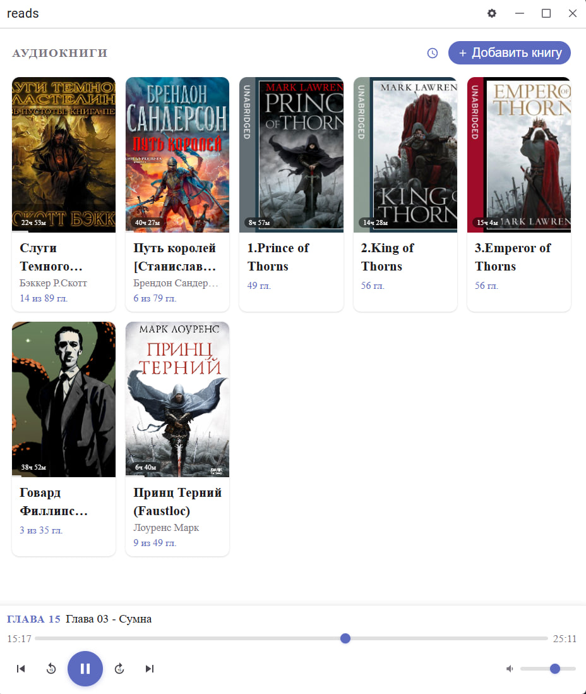

# Reads

Desktop audiobook player.

## Features

- Import audiobooks from local folders
- Custom player with chapter navigation and progress tracking
- Per-chapter progress saved to disk
- Sort library by last played time
- Cover art support

## Stack

- [Tauri 2](https://tauri.app) — desktop shell
- [Svelte 5](https://svelte.dev) + SvelteKit — UI
- SQLite (via `@tauri-apps/plugin-sql`) — local storage
- TypeScript

## Development

```bash
bun run tauri dev
```

## Build

```bash
bun run tauri build
```
